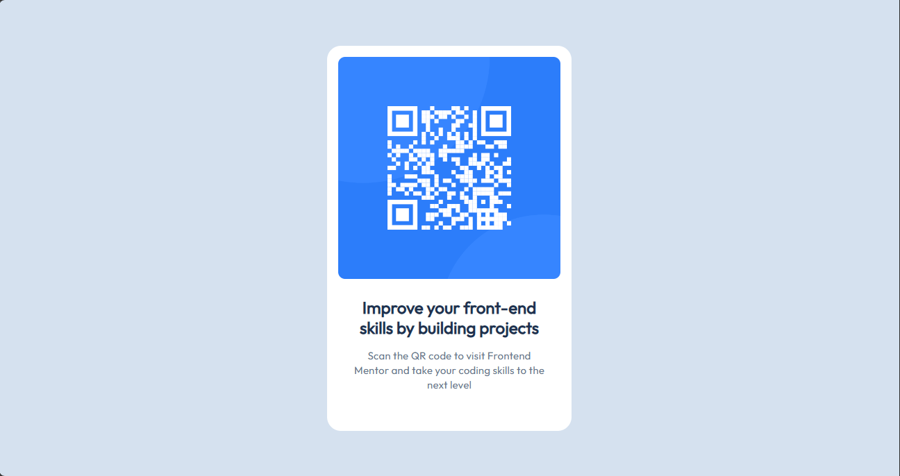

# Frontend Mentor - QR code component solution

Esta es una solución al [desafío del componente de código QR en Frontend Mentor](https://www.frontendmentor.io/challenges/qr-code-component-iux_sIO_H). Los desafíos de Frontend Mentor te ayudan a mejorar tus habilidades de codificación mediante la creación de proyectos realistas.

## Table of contents

- [Descripción General](#Descripcion-General)
  - [Screenshot](#screenshot)
  - [Links](#links)
- [Mi Proceso](#Mi-proceso)
  - [Construido con](#Construido-con)
  - [Recursos Utiles](#Recursos-Utiles)
- [Author](#author)
- [Agradecimientos](#Agradecimientos)

## Descripción General

### Screenshot

### Links

- Solution URL: [Add solution URL here](https://your-solution-url.com)
- Live Site URL: [Vercel App](https://qr-code-component-qi9vkvmb7-adriverions-projects.vercel.app/)

## Mi Proceso

### Construido con

- Semantic HTML5 markup
- CSS custom properties
- Flexbox
- Desktop-first workflow

### Recursos Utiles

- [Normalize CSS](https://necolas.github.io/normalize.css/) - Normaliza los estilos CSS que colocan los navegadores

## Author

- Frontend Mentor - [@Adriverion](https://www.frontendmentor.io/profile/Adriverion)
- X - [@_Adriverion_](https://x.com/_Adriverion_)

## Agradecimientos

Agradezco mucho a mis amigos que me motivaron a estudiar frontend
